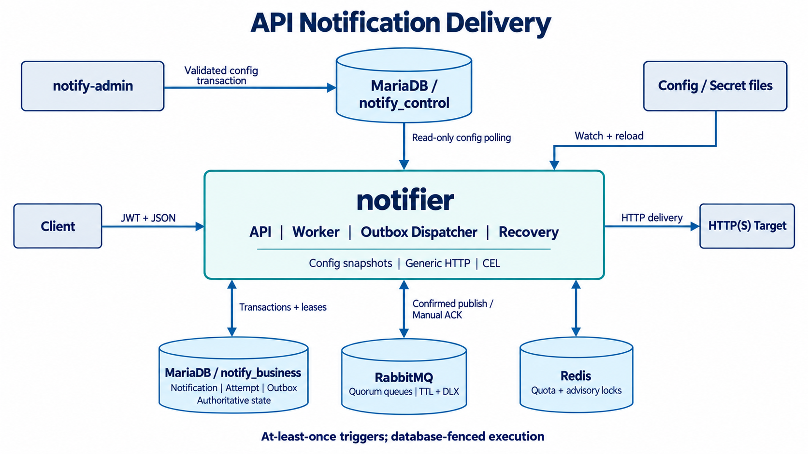
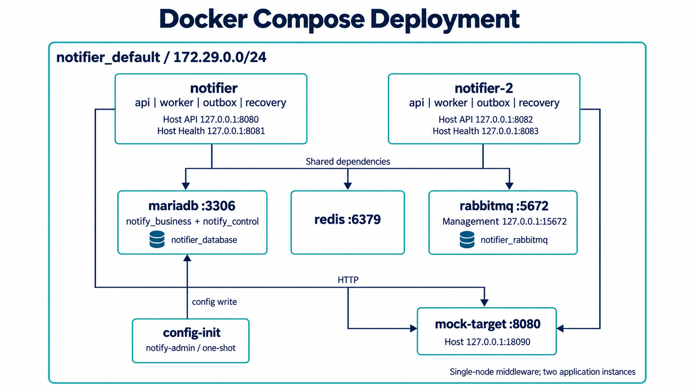

# API 通知投递系统

面向 HTTP(S) 接口的通知投递服务。调用方提交 Target、相对路径、Header、Query 和正文，服务负责持久化受理、异步或 Proxy 投递、结果判定、重试与状态查询。

MariaDB 是任务事实源；RabbitMQ 提供至少一次调度；Redis 提供配额和非权威锁。投递成功表示取得符合规则的 HTTP 响应，不等同于供应商业务处理成功。系统允许重复触发，不提供 Exactly-once 或顺序保证。

- [原始设计文档](docs/design.md)
- [OpenAPI 3.1 契约](api/openapi.yaml)

## 功能

| 能力 | 行为 |
|---|---|
| 持久化受理 | Notification 与首次 Outbox 在同一事务中写入，提交成功后返回受理结果 |
| 上游幂等 | `(client_id, idempotency_key)` 唯一；相同规范化请求返回原任务，不同请求返回 409 |
| 单条与批量 | 单条支持 async/proxy；批次仅异步，每项独立校验与提交 |
| HTTP 投递 | Target 固定 Origin，限制 Method/Path，复用连接池，限制响应读取大小 |
| 响应判定 | 默认按 HTTP 状态判定；CEL 可返回 success、retry、fail、report |
| 自动重试 | 固定延迟 Bucket、次数与期限约束，支持 Retry-After |
| 人工重试 | 仅对 failed 任务开放，校验 Client 权限与当前 Target，保留 ID、正文和对外幂等键 |
| 故障恢复 | 回收过期 Lease/Outbox，修复已到期但缺少有效调度的 pending 任务 |
| 资源控制 | Redis 原子入口/出口速率与并发限制；进程级并发上限；fail-open/closed |
| 安全 | JWT、Client-Target binding、DNS/IP 白名单、Secret 引用、响应与日志脱敏 |
| 配置刷新 | 管理库 revision 轮询；文件目录监听和内容校验；加载失败保留有效快照 |
| 运行角色 | 同一 `notifier` 二进制按 `api,worker,outbox,recovery` 启用角色 |

## 架构



### 投递链路

1. API 校验 JWT、Client-Target binding、请求与配额，在业务事务中写 Notification 和 Outbox。
2. Outbox Dispatcher 在短事务中领取记录，事务外发布持久消息，收到 Publisher Confirm 后更新发布状态。
3. Worker 校验 generation，取得资源额度，并通过数据库 CAS 写入 `in_flight`、lease token 和 started Attempt。
4. HTTP 调用在事务外执行。Worker 将 Attempt、最终状态或下一次重试 Outbox 同事务提交，之后 ACK 消息。
5. Recovery 回收过期租约和发布记录；对超过调度宽限期的 pending 任务推进 generation 并补发。

结果写回同时检查 ID、generation、lease token、状态和租约有效期。旧 Worker 的过期结果不能覆盖新执行。Redis 锁只降低并发碰撞，正确性不依赖 Redis 数据持久化。

Proxy 复用相同状态机与 Claim，先持久化再尝试同步执行。若第一次尝试被其他 Worker 领取或尚未形成终态，返回 202，调用方继续按 ID 查询。

### 数据与配置

| 数据库/对象 | 内容 |
|---|---|
| `notify_business.notification_task` | 请求快照、状态、幂等 hash、generation、lease、配置 revision |
| `notify_business.delivery_attempt` | 每次尝试的时间、HTTP 状态、结果、响应摘要与 Hook report |
| `notify_business.mq_outbox` | 待发布事件及其发布 token/lease |
| `notify_business.notification_batch` | 批次关联信息，不提供跨 item 事务 |
| `notify_control.config_snapshot` | 不可变的完整管理配置 JSON，保留历史 revision |
| `notify_control.config_revision` | 活动配置的 global revision |

运行账户对管理库只有 SELECT 权限，`notify-admin` 使用独立写账户。请求正文保存在 `request_json`，认证 Secret 在投递时从内存解析器注入，不写入请求快照。

Retry、Hook 和幂等注入使用任务创建时的配置；Client/Target 禁用、binding、Origin/Method/Path/IP 限制与认证使用投递开始时的最新有效配置。修改 Origin 会阻止旧任务访问旧站点，不会将旧请求自动改投新站点。

管理库不可用时保留已加载快照；未缓存的历史 revision 需等待管理库恢复。历史请求与配置的清理应遵守任务保留期和幂等保留期，不得删除非终态任务所需数据。

### HTTP 结果与重试

| 结果 | 默认动作 |
|---|---|
| 200–299 | success |
| 408、429、500–599 | retry |
| 临时 DNS/连接错误、超时、连接 reset | 按 Target 的不确定结果重试许可处理 |
| 300–399、其他 400–499 | fail；不自动跟随重定向 |
| 请求配置错误、目标地址被阻止、响应超限 | fail |

延迟 Bucket 为 `5s, 30s, 2m, 10m, 30m, 2h, 6h`。Retry-After 映射到不早于允许时间的 Bucket；序列耗尽、无法映射或超过 deadline 即停止自动处理。未知执行结果的 Lease Recovery 同样遵守重试许可、次数和期限。

完整响应在大小限制内读取后计算 SHA-256。保存的预览最多 8 KiB；不能安全解析的非结构化或截断预览不保留。CEL 接收限长响应，并受表达式长度、递归深度、AST 节点、运行 cost 和时间预算约束。

## 本地容器部署



[deploy/compose.yaml](deploy/compose.yaml) 定义两个应用实例和单节点中间件。所有端口映射绑定主机 loopback；MariaDB 和 Redis 只在 Compose 网络内提供服务。

| Compose service | 用途 | 主机访问 |
|---|---|---|
| `notifier` | api、worker、outbox、recovery | API `127.0.0.1:8080`；Health `127.0.0.1:8081` |
| `notifier-2` | 相同角色的第二实例 | API `127.0.0.1:8082`；Health `127.0.0.1:8083` |
| `mariadb` | 业务库与管理库 | 容器网络内 `3306` |
| `redis` | 配额与锁 | 容器网络内 `6379` |
| `rabbitmq` | Quorum 调度队列 | 管理端 `127.0.0.1:15672`；内部 AMQP `5672` |
| `mock-target` | 可配置 HTTP 响应与调用观测 | `127.0.0.1:18090` |
| `config-init` | 执行 `notify-admin` 写入初始配置后退出 | 无监听端口 |

两个应用容器内部均监听 API `8080`、Health `8081`。网络为 `notifier_default`，默认网段 `172.29.0.0/24`。Mock 主机端口可通过 `NOTIFIER_MOCK_PORT` 覆盖，部署与冒烟脚本须使用相同环境值；修改网段时须同步调整 Target 的 `allowed_cidrs`。

### 构建与启动

要求 Go 1.27.1、Docker Engine/Compose、Python 3 和 OpenSSL。在仓库根目录执行：

```sh
make build
sh scripts/deploy-local.sh
python3 scripts/health.py
```

`make build` 生成 `bin/notifier`、`bin/notify-admin`、`bin/mock-target` 和 `bin/healthcheck`。

`deploy-local.sh` 检查工具与 Docker，按需调用 `local-setup.sh` 生成本地配置，拉取 MariaDB 11.8、Redis 8.10.1、RabbitMQ 4.3.5 镜像，构建应用，并按健康依赖启动容器。Dockerfile 使用 Go 构建镜像和 distroless nonroot 运行镜像；应用 RootFS 只读。

首次启动空 MariaDB 数据卷时依次执行：

1. [migrations/001_business.sql](migrations/001_business.sql)：业务库、表与索引。
2. [migrations/002_control.sql](migrations/002_control.sql)：管理库、配置快照与 revision。
3. [deploy/local/init-users.sh](deploy/local/init-users.sh)：独立业务、管理只读和管理写账户。
4. `config-init`：校验生成配置并事务写入管理库。

已有数据卷不会重复执行初始化 SQL；修改 `.env` 不会自动轮换数据库内的账户密码。生产 Schema 和账户管理应由独立迁移作业执行。

### 本地配置与凭证

`scripts/local-setup.sh` 生成随机数据库/MQ 密码、JWT 密钥和配置文件，拒绝覆盖现有 `.env` 或 `configs/secrets/`。可在首次初始化时指定管理配置示例：

```sh
sh scripts/local-setup.sh configs/examples/idempotency.json
sh scripts/deploy-local.sh
TOKEN=$(sh scripts/dev-token.sh idempotency-client)
```

默认示例使用 `demo-client`，Token 有效期为一小时：

```sh
TOKEN=$(sh scripts/dev-token.sh)
curl -i http://127.0.0.1:8080/api/v1/notifications \
  -H "Authorization: Bearer $TOKEN" \
  -H 'Idempotency-Key: notification-example-1' \
  -H 'Content-Type: application/json' \
  --data '{"target":"target-a","delivery_mode":"async","request":{"method":"POST","path":"/a","query":{"failures":"1"},"headers":{"Content-Type":"application/json"},"body":"{\"order_id\":\"order-1\"}"}}'
```

RabbitMQ 管理用户名为 `notifier`，密码由本地 `.env` 中的 `AMQP_PASSWORD` 提供。

## 管理配置示例

管理配置使用 JSON，包含 `clients`、`targets`、`retry_policies`、`quota_policies`、`hooks` 和 `issuers` 六类对象。以下管理示例均为完整文档，不是可直接叠加的片段；写入时需保留现有实体并正确推进已修改实体的 revision。

| 文件 | Client / Target | 展示的契约 |
|---|---|---|
| [configs/management.example.json](configs/management.example.json) | `demo-client`、`audit-client`、`limited-client`；`target-a` 至 `target-d`、`target-limited` | 普通 HTTP、业务码 Hook、非幂等、Retry-After、共享入口/出口配额 |
| [configs/examples/idempotency.json](configs/examples/idempotency.json) | `idempotency-client`；`header-idempotency`、`query-idempotency`、`json-idempotency`、`non-idempotent` | Header、Query、JSON Pointer 注入；不确定结果禁止自动重试 |
| [configs/examples/response-hooks.json](configs/examples/response-hooks.json) | `hook-client`；`business-response`、`report-response` | 业务码决定动作；report 仅记录扩展字段并保留 HTTP 判定 |
| [configs/examples/fail-closed.json](configs/examples/fail-closed.json) | `quota-client`；`quota-target` | 入口/出口速率与并发限制；Redis 不可用时拒绝或延后处理 |
| [configs/examples/secret-auth.json](configs/examples/secret-auth.json) | `partner-client`；`authenticated-http` | HTTPS、静态认证 Header、Secret 引用、未知幂等且自动重试关闭 |
| [configs/examples/secret-process.json](configs/examples/secret-process.json) | 进程配置 | 将 `partner-token` 映射为容器中的只读 Secret 文件 |

`audit-client` 可向绑定 Target 提交任务，但没有人工重试权限；它不是只读账户。`limited-client` 的入口限制为每秒一条，`target-limited` 的出口限制为每秒一条。

管理示例的 `issuers` 默认为空，不含实际公钥。`local-setup.sh` 会为本地环境填入生成的公钥；其他环境需配置 issuer、audience、RS256/ES256 算法及 `kid → PEM 公钥` 映射。Secret 示例中的 `api.example.com` 是占位域名，需替换为实际供应商，并先准备 Secret 与挂载。

### 校验与应用

```sh
bin/notify-admin -file configs/examples/response-hooks.json
# NOTIFIER_ADMIN_DSN 由环境或 Secret 管理系统注入
bin/notify-admin -file configs/secrets/management.json -apply -actor config-change
```

不带 `-apply` 时仅校验 JSON、引用关系、白名单、配额与 CEL。带 `-apply` 时锁定 global revision，校验 Target/Retry/Hook revision 单调递增，同事务插入不可变快照并推进活动版本。运行实例每两秒检查 revision，加载失败保留 Last-Known-Good。

文件 Secret 的值是完整 Header 值，例如 `Bearer ...`。先分发 Secret 文件，再应用引用它的配置；撤销引用应通过 Target 禁用或认证配置变更生效。文件更新有 300ms debounce 和 30 秒内容校验兜底；端口、角色、连接、并发和 CA 属于启动配置。

## API

业务接口前缀为 `/api/v1`，使用 Bearer JWT。请求只允许提交 Target 和已解码的相对路径；禁止覆盖 Origin、认证、Hook、Adapter 或重试期限。

| 方法与路径 | 语义 |
|---|---|
| `POST /api/v1/notifications` | 单条提交，幂等键使用 `Idempotency-Key` Header |
| `POST /api/v1/notifications:batch` | 逐项独立受理，item 使用 `idempotency_key` |
| `GET /api/v1/notifications/{notification_id}` | 查询当前 Client 的任务及最近 100 条 Attempt |
| `GET /api/v1/notifications` | 支持 status、target、batch_id、cursor、limit 过滤/分页 |
| `POST /api/v1/notifications/{notification_id}:retry` | 对 failed 任务开启新的有限重试周期 |

查询默认不返回完整请求正文和 Header。正文编码支持 UTF-8/base64；等价字节、Method/Header 规范化后参与幂等 hash。正文 JSON 的内部空白和键序仍保留字节语义。

状态为 `pending`、`in_flight`、`delivered`、`failed`。人工重试不清零累计 Attempt 序号；需要修改正文时应新建任务。批次重放产生新的关联批次，但已有任务保留原始 batch_id。

## 进程配置与资源限制

进程文件默认是 [configs/notifier.example.json](configs/notifier.example.json)，由 `NOTIFIER_CONFIG` 指定。连接凭证通过环境注入：

| 环境变量 | 含义 |
|---|---|
| `NOTIFIER_CONFIG` | 进程配置 JSON 文件 |
| `NOTIFIER_ROLES` | 逗号分隔的 api、worker、outbox、recovery，覆盖文件角色 |
| `NOTIFIER_BUSINESS_DSN` | 业务库 DML 账户 |
| `NOTIFIER_CONTROL_DSN` | 管理库 SELECT 账户 |
| `NOTIFIER_ADMIN_DSN` | 管理 CLI 写账户 |
| `NOTIFIER_AMQP_URL` | AMQP/AMQPS；worker/outbox 角色必需 |
| `NOTIFIER_REDIS_URL` | Redis/rediss endpoint |

| 限制/默认值 | 配置位置 |
|---|---|
| API 总请求 2 MiB；通知正文 1 MiB；Batch 100 项 | API/应用固定上限 |
| 每进程 Worker 32、Target 并发 8、prefetch 32、DB max open 64 | 进程 JSON |
| HTTP 连接 2s、请求 10s、响应读取 1 MiB、预览 8 KiB | Target endpoint / preview_bytes |
| HTTP 请求最多 30s；响应读取最多 16 MiB；预览最多 8 KiB | Target 校验上限 |
| Notification lease 60s；Outbox 发布 lease 30s | 数据库 Claim/恢复逻辑 |
| Recovery 5s；缺失调度宽限 60s | Recovery/Repository |
| graceful drain 45s；Compose/Kubernetes 容器 grace 55s | 进程生命周期/部署文件 |

Quota 使用 Redis 服务器时间的固定一秒窗口；0 表示该分布式维度不限制。所有 policy 的全局限额必须一致。Batch envelope 消耗一次入口额度，合法的新 item 再逐个计费。Redis 不可用时 fail-open 保留进程并发限制；fail-closed 拒绝入口或延后已受理任务。

## Kubernetes

[deploy/kubernetes.yaml](deploy/kubernetes.yaml) 包含 `Deployment/notifier`（两副本）、`Service/notifier`（API 8080）及 `PodDisruptionBudget/notifier`。同一镜像也可用 `NOTIFIER_ROLES` 拆分 API 与后台执行实例。

部署需要提供文件中引用的资源：

- `ConfigMap/notifier-process`：`notifier.json`，其中 `health_listen` 为 `:8081`。
- `Secret/notifier-connections`：数据库、Redis、AMQP 环境变量。
- `Secret/notifier-target-secrets`：Target 使用的只读凭证文件。
- 可访问的数据库、Redis、RabbitMQ endpoint，以及对应的账户、Schema、配置快照。

清单中的 `notifier:local` 应替换为集群可获取的镜像地址。业务 HTTP listener 的 HTTPS 入口由平台网关提供；清单不创建 Ingress、网关或中间件集群。Health 8081 不加入业务 Service，应限制到内部监控网络。供应商 HTTPS 使用系统 CA，可通过 `SSL_CERT_FILE`/`SSL_CERT_DIR` 指向挂载的企业 CA。

SIGTERM 先将 readiness 置为 false，停止新请求和新消费，等待已开始的 Attempt 提交/ACK；超出 grace 的任务由 RabbitMQ 重投与数据库租约恢复接续处理。

## 健康检查与日志

| 接口 | 判定 |
|---|---|
| `/health/live` | HTTP 事件循环可响应，不因外部依赖中断直接失败 |
| `/health/ready` | 业务库、有效快照及角色需要的依赖可用；drain 时返回 503 |
| `/health/detail` | 依赖状态、instance_id、配置 revision、活跃 Worker 和降级标记 |

API-only 角色 readiness 不依赖 MQ；worker/outbox 角色依赖 MQ。配置中存在 fail-closed policy 且 Redis 不可用时 readiness 为 false。管理库临时中断不使已加载快照失效。

应用输出 `slog` JSON 日志，每 30 秒记录受理、成功、失败、重试、积压、Outbox、MQ 错误、Lease 回收、Quota 与配置刷新指标。进程计数在重启后归零，共享积压来自数据库。

```sh
python3 scripts/health.py
docker compose --env-file .env -f deploy/compose.yaml ps --all
docker compose --env-file .env -f deploy/compose.yaml logs -f notifier notifier-2
python3 scripts/collect-runtime.py
```

## 测试

[scripts/smoke.py](scripts/smoke.py) 使用默认配置执行 API、幂等、Hook、配额和双实例场景；[scripts/recovery-smoke.py](scripts/recovery-smoke.py) 覆盖 Redis/MQ 中断和 HTTP 执行中的 Worker 终止。

```sh
python3 scripts/seed-smoke.py
python3 scripts/smoke.py
python3 scripts/recovery-smoke.py
```

[tests/e2e/cases.py](tests/e2e/cases.py) 定义 51 个运行时 E2E 用例：P0 12 个、P1 21 个、P2 18 个，包含 L9 和 L8 正交组。P0 覆盖受理/权限/投递/恢复；P1 覆盖策略、版本、配额与消息补偿；P2 覆盖边界、响应保护、热更新、角色和生命周期。

| 正交组 | 因素 | 覆盖 |
|---|---|---|
| O1，L9(3⁴) | 响应：200/503→200/400；模式：async/proxy/batch；注入：Header/Query/JSON；入口：notifier/notifier-2/双实例并发 | 54 个二因素组合，每种一次 |
| O2，L8(2⁴) | async/proxy；POST/PUT；UTF-8/base64；notifier/notifier-2 | 24 个二因素组合，每种两次 |

`--list` 输出完整 ID、标题、优先级、分组、矩阵行和覆盖频数。执行器通过真实 API、SQL、消息队列和独立 HTTP 供应商进程观察结果；故障、配置与配额用例串行操作本项目的本地容器，结束后恢复活动配置和依赖。

```sh
python3 tests/e2e/run.py --list
python3 tests/e2e/run.py
python3 tests/e2e/run.py --priority P0
python3 tests/e2e/run.py --cases O1-,O2-
```

E2E 要求独占本地验收环境及可用端口 18091。测试的配置、辅助程序、日志和结果位于 `.runtime/e2e/<run-id>/`。`make check` 执行 Go vet、模块校验与 diff 检查。

## 仓库文件

| 路径 | 内容 |
|---|---|
| `cmd/notifier/` | 依赖组装、角色启动和生命周期 |
| `cmd/notify-admin/` | 管理配置校验与写入 CLI |
| `cmd/mock-target/`、`cmd/healthcheck/` | 本地供应商响应与容器探针 |
| `internal/api/`、`internal/application/` | HTTP 接口和用例编排 |
| `internal/config/`、`internal/auth/` | 配置快照、监听、Secret 与 JWT |
| `internal/repository/business/` | 业务事务、Claim、Outbox 与恢复查询 |
| `internal/delivery/`、`internal/target/`、`internal/hook/` | 投递执行、HTTP Adapter 和 CEL |
| `internal/mq/rabbitmq/`、`internal/outbox/`、`internal/recovery/` | 消息拓扑、发布、消费和恢复循环 |
| `internal/retry/`、`internal/quota/`、`internal/lock/` | 重试策略和资源控制 |
| `internal/observability/`、`internal/domain/` | Health/日志与领域数据类型 |
| `configs/`、`migrations/`、`deploy/` | 配置示例、Schema 和部署定义 |
| `api/openapi.yaml` | API 契约 |
| `scripts/`、`tests/e2e/` | 部署辅助、状态采集、冒烟和 E2E 用例 |

`.env`、`configs/secrets/`、`.runtime/`、`bin/`、Python 缓存与密钥文件由 `.gitignore` 排除，并在 `.dockerignore` 中排除敏感构建输入。数据库和 RabbitMQ 数据存放于 Docker named volumes `notifier_database`、`notifier_rabbitmq`。

停止容器并保留数据：

```sh
docker compose --env-file .env -f deploy/compose.yaml down
```
