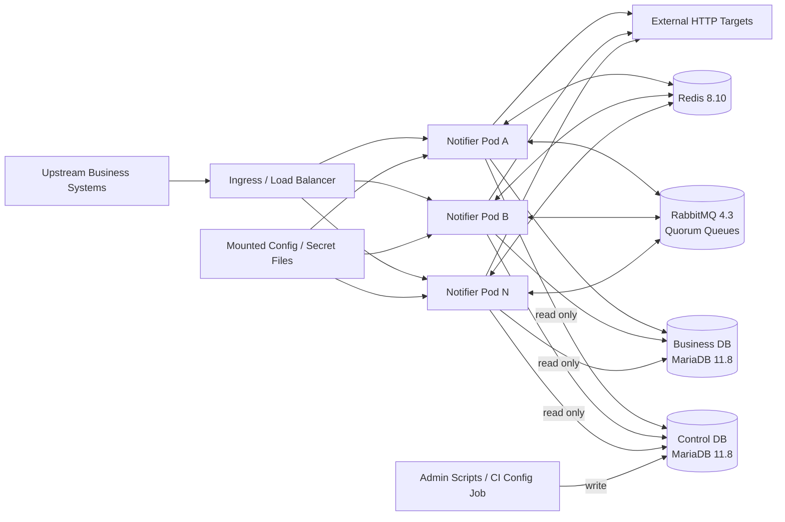
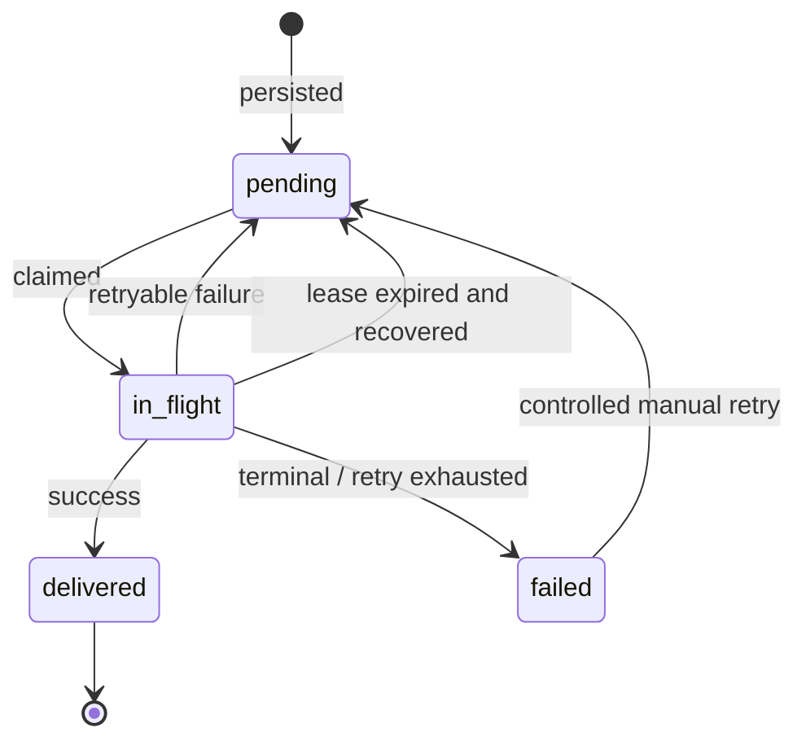
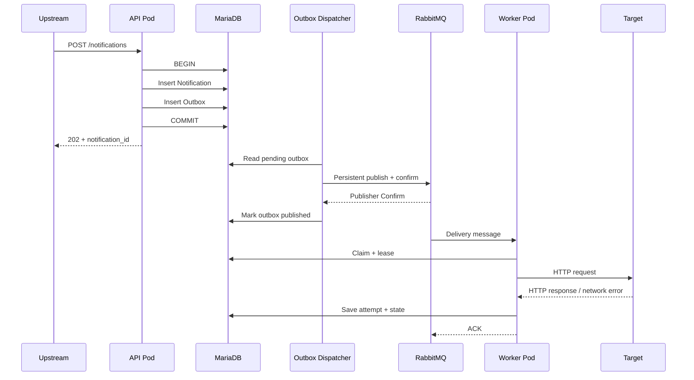
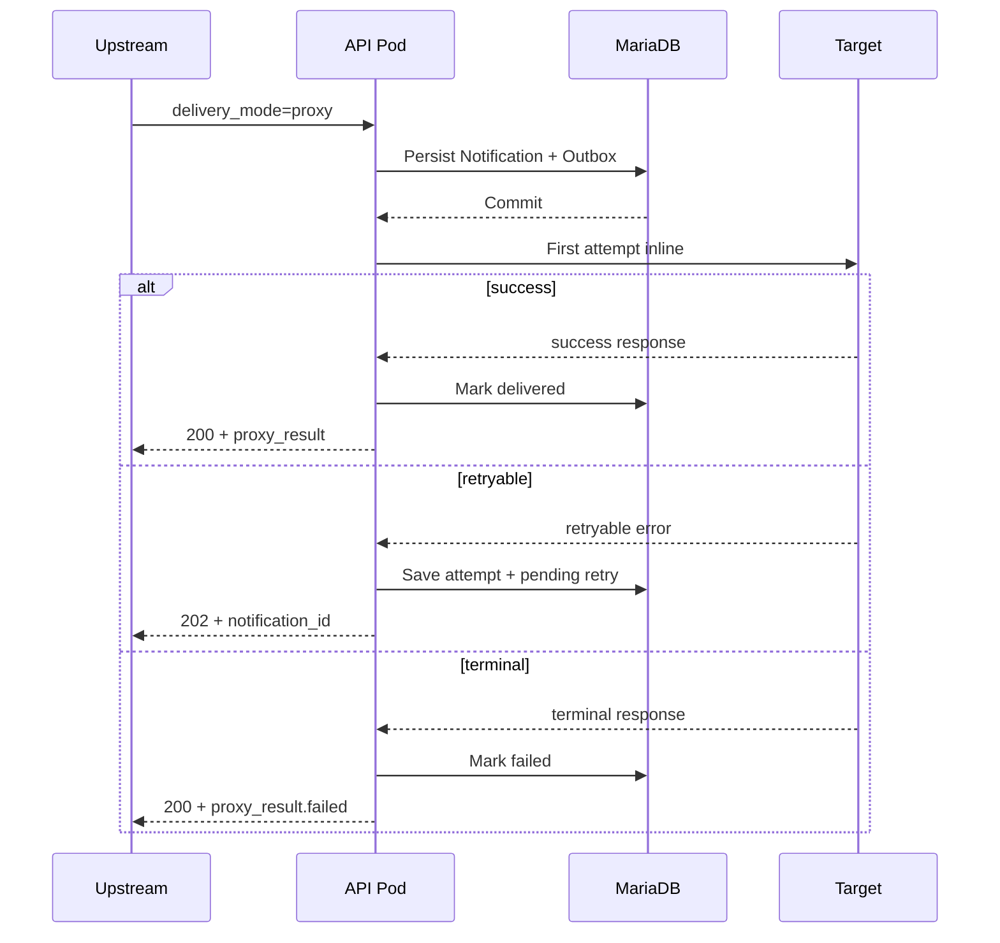
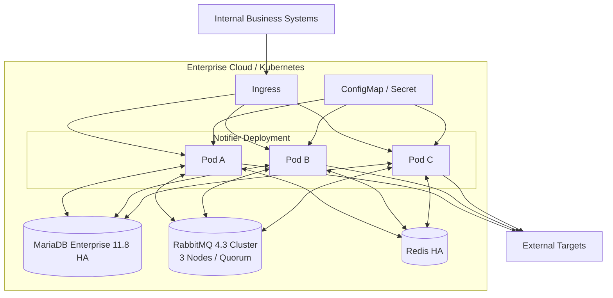

# API 通知投递系统技术设计方案

> 文档版本：v1.0  
> 设计基线：2026-09-12  
> 系统定位：企业内部通用 HTTP(S) 通知投递服务  
> 实现语言：Go 1.27.1

---

## 目录

- [1. 设计目标与系统边界](#1-设计目标与系统边界)
- [2. 整体设计](#2-整体设计)
  - [2.1 架构原则](#21-架构原则)
  - [2.2 技术栈](#22-技术栈)
  - [2.3 总体架构](#23-总体架构)
  - [2.4 核心状态与可靠性模型](#24-核心状态与可靠性模型)
  - [2.5 核心业务流程](#25-核心业务流程)
- [3. 详细设计](#3-详细设计)
  - [3.1 服务模块](#31-服务模块)
  - [3.2 配置与管理数据](#32-配置与管理数据)
  - [3.3 数据存储](#33-数据存储)
  - [3.4 消息队列与重试调度](#34-消息队列与重试调度)
  - [3.5 HTTP 投递与 Target](#35-http-投递与-target)
  - [3.6 幂等、重复投递与顺序](#36-幂等重复投递与顺序)
  - [3.7 Worker、租约、锁与恢复](#37-worker租约锁与恢复)
  - [3.8 Quota 与资源控制](#38-quota-与资源控制)
  - [3.9 鉴权与安全](#39-鉴权与安全)
  - [3.10 可观测性](#310-可观测性)
- [4. 接口与配置契约](#4-接口与配置契约)
- [5. 云上容器化部署](#5-云上容器化部署)
- [6. 开发、测试与验收](#6-开发测试与验收)
- [7. 实施步骤](#7-实施步骤)
- [8. 演进方向](#8-演进方向)

---

## 1. 设计目标与系统边界

### 1.1 业务目标

企业内部多个业务系统在关键事件发生后，需要向外部供应商 HTTP(S) API 发起通知，例如广告转化通知、CRM 状态更新、库存变更等。不同供应商的地址、认证方式、 Header、Query、Body、幂等能力及响应规则存在差异。

系统提供统一的通知投递能力，上游提交已经组装好的 HTTP 请求描述，系统负责：

- 持久化受理；
- 异步或 Proxy 模式投递；
- HTTP 层结果判定；
- 可配置失败解析；
- 自动重试与人工受控重试；
- 状态查询；
- Target 配置化接入；
- 基础鉴权、Quota、白名单和审计；
- 进程异常、重启、容器漂移后的任务恢复。

### 1.2 可靠性边界

系统责任从“通知请求成功持久化”开始。

系统保证的是自身定义范围内的 HTTP 投递行为，不保证外部供应商完成业务处理。默认情况下，符合 Target 成功规则的 HTTP 响应即表示一次投递成功；业务响应码、响应 Body 中的业务状态不参与默认判定。

Target 可以配置受限响应 Hook，对供应商原始响应摘要做解析，并将结果归类为：

- `success`：投递完成；
- `retry`：进入自动重试；
- `fail`：停止自动处理；
- `report`：记录结构化扩展字段，同时沿用基础判定结果。

Hook 不直接执行任意网络、文件、系统命令或用户上传代码。复杂副作用逻辑不放在表达式层中执行。

### 1.3 明确不承诺的能力

第一版不承诺：

- 外部业务最终执行成功；
- Exactly-once；
- 全局顺序、同业务对象顺序或 FIFO；
- 业务有效期判断；
- “业务事务已提交但业务方尚未提交通知”的端到端事务一致性；
- 完整租户隔离、复杂 RBAC 或独立管理端；
- 任意代码动态加载；
- 自适应熔断、复杂流量治理、跨地域容灾；
- 单个 Pod 持续可用；
- 数据库永久损坏后的业务恢复。

系统允许至少一次触发和重复投递。是否可以安全重复调用由 Target 配置定义；对不支持幂等且存在不可逆副作用的 Target，自动重试策略必须显式配置。

---

## 2. 整体设计

### 2.1 架构原则

#### 无状态应用进程

服务部署于企业云上容器平台，应用 Pod 不保存任何必须恢复的本地状态：

- Notification、Attempt、Outbox 等权威状态存储在 MariaDB；
- 调度消息存储在 RabbitMQ；
- 分布式锁和 Quota 存储在 Redis；
- 管理配置来自只读配置文件和管理库；
- 本地配置仅保存在内存不可变快照中；
- Pod 被销毁、漂移或滚动升级后，无需恢复本地磁盘内容。

同一镜像可水平扩容多个实例。API、Worker、Outbox Dispatcher、Recovery Loop 在同一二进制中按模块运行，并通过配置开关允许在生产环境中按同一镜像拆分角色。

#### MariaDB 为权威事实源

任务状态以 MariaDB 为唯一权威数据源。RabbitMQ 和 Redis 不承担任务最终事实判断：

- RabbitMQ 消息重复或丢失可通过数据库 Reconciler 修复；
- Redis 临时不可用不应导致已持久化任务永久丢失；
- Worker 更新任务必须通过数据库 generation、状态和 lease 条件校验。

#### 至少一次触发

跨组件链路采用至少一次触发模型：

- Outbox 可能重复发布；
- RabbitMQ 可能重复投递；
- Worker 崩溃后任务可能再次执行；
- 网络超时可能导致供应商实际已收到请求，但本系统无法确认。

系统通过本地幂等、generation、租约和下游幂等配置控制重复副作用。投递语义采用至少一次触发，分布式 Exactly-once 不在系统能力范围内。

#### 配置优先

新 Target 优先使用 Generic HTTP Adapter 和配置完成接入。只有签名、协议封装、认证刷新等无法由通用配置表达的场景，才通过编译期 SDK Adapter 接入。

### 2.2 技术栈

#### 基础组件

| 组件                      |               版本基线 | 用途                          |
| ------------------------- | ---------------------: | ----------------------------- |
| Go                        |             **1.27.1** | 应用开发与运行时              |
| MariaDB Enterprise Server |       **11.8.5-2 LTS** | 业务库与管理库生产部署        |
| MariaDB Community Server  |             **11.8.x** | 本地开发、CI 和兼容性测试     |
| Redis Open Source         |             **8.10.1** | 轻量锁、Quota、短期非权威状态 |
| RabbitMQ                  |              **4.3.5** | 持久化异步消息与重试调度      |
| Docker / OCI              |         OCI Image Spec | 应用和本地依赖容器化          |
| Kubernetes                | 企业平台当前受支持版本 | 生产容器编排目标              |

MariaDB 11.8 为 LTS 系列。数据库 DDL、查询与驱动限定在 MariaDB 与 MySQL 8.x 的常用兼容子集，覆盖协议、InnoDB 事务语义及本系统实际使用的 SQL。仅 MySQL 8 支持的专有行为、完整二进制兼容和完整特性级兼容不属于兼容性目标。

RabbitMQ 采用生产级持久化配置：

- Durable Exchange；
- Quorum Queue；
- Persistent Message；
- Publisher Confirm；
- Manual Consumer Ack；
- Dead Letter Exchange；
- 多副本生产集群。

本地开发允许单节点 RabbitMQ 容器，但拓扑、Exchange、Queue 类型和消息语义与生产保持一致。

#### Go 直接依赖

| 库                               |        版本 | 用途                         |
| -------------------------------- | ----------: | ---------------------------- |
| `github.com/go-sql-driver/mysql` | **v1.10.0** | MariaDB/MySQL 协议数据库驱动 |
| `github.com/redis/go-redis/v9`   | **v9.21.0** | Redis 客户端                 |
| `github.com/rabbitmq/amqp091-go` | **v1.13.0** | RabbitMQ AMQP 0-9-1 客户端   |
| `github.com/golang-jwt/jwt/v5`   |  **v5.3.1** | JWT 校验                     |
| `github.com/cel-expr/cel-go`     | **v0.30.0** | 受限响应表达式               |
| `github.com/fsnotify/fsnotify`   | **v1.10.1** | 配置文件变更监听             |

HTTP Server、HTTP Client、JSON、日志、TLS、哈希、数据库连接池、Context 等优先使用 Go 标准库。

### 2.3 总体架构



生产部署中，业务库与管理库逻辑隔离、账户隔离；可部署在同一 MariaDB 集群的不同 Database，也可使用不同实例。运行时服务只读管理库。

### 2.4 核心状态与可靠性模型

Notification 状态机：



状态含义：

- `pending`：等待首次投递或下一次重试；
- `in_flight`：某个 Worker 持有有效租约；
- `delivered`：按照 Target 当前成功规则取得成功确认；
- `failed`：自动处理已经停止，不代表供应商一定没有执行。

每次有效重新调度都会推进 `dispatch_generation`。Worker 只有在 generation、lease token 和状态同时匹配时才能写入执行结果。

### 2.5 核心业务流程

#### 默认异步投递



#### Proxy 模式

Proxy 模式仍遵循“先持久化，后第一次同步投递”。Proxy 只改变调用方是否等待第一次尝试，不改变持久化、重试和状态机。



---

## 3. 详细设计

### 3.1 服务模块

推荐代码结构：

```text
cmd/notifier/
internal/
  api/                  # REST API、DTO、参数校验
  auth/                 # JWT 校验与调用方身份
  application/          # 用例编排
  domain/               # Notification / Attempt / Target
  config/
    snapshot/           # 不可变配置快照
    filewatcher/        # 文件监听
    dbwatcher/          # 管理库版本监听
    validator/          # 配置完整性检查
  target/
    generic_http/       # 通用 HTTP Target
    sdk/                # 编译期 SDK Adapter
  delivery/             # 投递编排
  retry/                # 重试策略
  hook/                 # HTTP 默认规则 + CEL
  quota/                # Redis Quota
  lock/                 # Redis 轻量锁
  repository/
    business/           # 业务库读写
    control/            # 管理库只读
  mq/rabbitmq/          # AMQP publish / consume / topology
  outbox/               # Transactional Outbox
  recovery/             # Lease / MQ / Outbox 修复
  observability/        # slog、内部计数、Health
  lifecycle/            # 启停、drain、readiness
migrations/
configs/
scripts/
testdata/
deploy/
```

单个二进制包含所有模块，通过运行角色控制实际启用：

```text
NOTIFIER_ROLES=api,worker,outbox,recovery
```

常规 MVP 启用全部运行角色。较大规模生产可使用同一镜像分别部署 API Pod 和 Worker Pod，代码仓库与内部协议保持统一。

### 3.2 配置与管理数据

#### 配置来源

配置分为两类：

**进程级静态/半静态配置**，来源于只读挂载文件、环境变量和 Secret，例如：

- 数据库连接信息；
- RabbitMQ 地址；
- Redis 地址；
- HTTP Server 端口；
- 运行角色；
- TLS 根证书；
- 配置监听参数。

**业务管理配置**，来源于管理库，例如：

- Client；
- Target；
- Retry Policy；
- Quota Policy；
- Client-Target Binding；
- JWT Issuer；
- Hook；
- Secret 引用元数据。

运行时不允许业务请求覆盖 Target 的 Base URL、认证配置、Hook、最大重试期限、Adapter 类型或白名单约束。

#### 内存快照

配置在进程中以不可变 `ConfigSnapshot` 保存：

```go
type ConfigSnapshot struct {
    Revision uint64
    LoadedAt time.Time
    Targets map[string]TargetConfig
    Clients map[string]ClientConfig
    RetryPolicies map[string]RetryPolicy
    QuotaPolicies map[string]QuotaPolicy
    Hooks map[string]CompiledHook
}
```

更新流程：

1. Watcher 检测变更；
2. 读取完整或受影响配置；
3. 进行 Schema、引用关系、Hook 编译、白名单等校验；
4. 构造新的完整快照；
5. 原子替换指针；
6. 正在执行的请求继续使用开始时取得的旧快照；
7. 新请求使用新快照。

加载失败时保留 Last-Known-Good 快照，并记录 `config_reload_failed`。配置错误不能使所有 Pod 同时丢失现有可用配置。

#### 配置文件监听

使用 `fsnotify v1.10.1` 监听配置文件所在父目录，以兼容容器平台 ConfigMap/Secret 常见的原子替换和符号链接切换方式。

监听事件包括：

- create；
- write；
- rename；
- remove。

事件采用 200~500 ms debounce 后重新加载。另设低频文件内容 hash 校验作为兜底，防止底层挂载机制没有产生可见 fsnotify 事件。

文件只作为配置输入，运行时不会将状态写回容器文件系统。

#### 管理库变更监听

MariaDB 不提供 PostgreSQL `LISTEN/NOTIFY` 类原生推送接口。管理库使用单调递增版本表形成 DB Watcher：

```text
config_revision
---------------
scope          VARCHAR(64) PK
revision       BIGINT UNSIGNED
updated_at     DATETIME(6)
```

管理脚本修改配置时必须在同一事务中：

```text
BEGIN
  update target/retry/quota/...
  increment config_revision
COMMIT
```

每个 Pod 运行轻量 DB Watcher：

- 默认每 2 秒读取 `config_revision`；
- revision 未变化时不加载业务配置；
- revision 变化时按 scope 做增量读取；
- 更新后构建并原子替换完整快照；
- MariaDB 临时不可用时继续使用 Last-Known-Good；
- 恢复后自动追平当前 revision。

配置刷新采用监听式机制，业务请求直接读取进程内配置快照。管理库故障期间，已持有有效快照的实例继续处理投递任务；冷启动实例必须成功加载初始快照后才能 Ready。

#### 配置一致性

Notification 在创建时固化与投递语义相关的关键配置引用：

```text
target_id
target_revision
retry_policy_id
retry_policy_revision
hook_id
hook_revision
```

请求 URL、Header、Body 等请求快照保存在业务库。

默认策略：

- Endpoint 禁用、凭证撤销等安全性配置立即按最新快照生效；
- Retry 参数、Hook 判定、幂等注入等行为以 Notification 固化 revision 为准；
- 历史 revision 在管理库保留，直到相关任务超过数据保留期。

这样可以避免一次长周期重试任务在中途因普通配置更新而产生不可解释的语义漂移。

### 3.3 数据存储

#### 数据库与账户隔离

逻辑 Database：

```text
notify_business
notify_control
```

账户：

```text
notify_runtime_business
  SELECT, INSERT, UPDATE, DELETE on notify_business.*

notify_runtime_control
  SELECT on notify_control.*

notify_admin_control
  SELECT, INSERT, UPDATE, DELETE on notify_control.*
```

生产环境禁止应用运行账户对管理库执行写操作。

#### `notification_task`

核心字段：

```text
id                    BINARY(16) PK
client_id             VARCHAR(64) NOT NULL
target_id             VARCHAR(64) NOT NULL
batch_id              BINARY(16) NULL

client_idem_key       VARCHAR(128) NOT NULL
request_hash          BINARY(32) NOT NULL

method                VARCHAR(16) NOT NULL
path                  VARCHAR(2048) NOT NULL
query_json            JSON NULL
headers_json          JSON NULL
body_blob             LONGBLOB NULL
content_type          VARCHAR(255) NULL

delivery_mode         VARCHAR(16) NOT NULL
status                VARCHAR(16) NOT NULL

attempt_count         INT UNSIGNED NOT NULL DEFAULT 0
dispatch_generation   BIGINT UNSIGNED NOT NULL DEFAULT 1
next_attempt_at       DATETIME(6) NULL
retry_deadline_at     DATETIME(6) NULL

lease_token           BINARY(16) NULL
lease_until           DATETIME(6) NULL

last_http_status      INT NULL
last_error_code       VARCHAR(64) NULL
last_error_message    VARCHAR(1024) NULL

target_revision       BIGINT UNSIGNED NOT NULL
retry_revision        BIGINT UNSIGNED NULL
hook_revision         BIGINT UNSIGNED NULL

created_at            DATETIME(6) NOT NULL
updated_at            DATETIME(6) NOT NULL
delivered_at          DATETIME(6) NULL
```

核心索引：

```text
UNIQUE KEY uk_client_idem (client_id, client_idem_key)
KEY idx_status_next (status, next_attempt_at)
KEY idx_target_status (target_id, status, next_attempt_at)
KEY idx_batch (batch_id)
KEY idx_lease (status, lease_until)
```

UUID 使用应用层生成的 UUIDv7，数据库存储为 `BINARY(16)`。

#### `delivery_attempt`

```text
id                    BIGINT UNSIGNED AUTO_INCREMENT PK
notification_id       BINARY(16) NOT NULL
attempt_no            INT UNSIGNED NOT NULL
dispatch_generation   BIGINT UNSIGNED NOT NULL
lease_token           BINARY(16) NOT NULL

started_at            DATETIME(6) NOT NULL
finished_at           DATETIME(6) NULL

http_status           INT NULL
result                VARCHAR(16) NOT NULL
error_code            VARCHAR(64) NULL
error_message         VARCHAR(1024) NULL
latency_ms            INT UNSIGNED NULL

response_headers_json JSON NULL
response_body_preview VARBINARY(8192) NULL
response_body_hash    BINARY(32) NULL
hook_result_json      JSON NULL
```

响应 Body 默认最多保存前 8 KiB 脱敏摘要及完整 Body 的 SHA-256，不无上限保存供应商响应。

#### `mq_outbox`

```text
id                    BIGINT UNSIGNED AUTO_INCREMENT PK
event_id              BINARY(16) NOT NULL
notification_id       BINARY(16) NOT NULL
generation            BIGINT UNSIGNED NOT NULL
event_type            VARCHAR(32) NOT NULL
routing_key            VARCHAR(128) NOT NULL
available_at          DATETIME(6) NOT NULL
payload_json          JSON NOT NULL
status                VARCHAR(16) NOT NULL
published_at          DATETIME(6) NULL
created_at            DATETIME(6) NOT NULL

UNIQUE KEY uk_event_id (event_id)
KEY idx_outbox_pending (status, available_at, id)
```

Notification 状态更新和对应 Outbox 写入必须处于同一个 MariaDB 事务。

#### 批次

`notification_batch` 只提供关联查询：

```text
id          BINARY(16) PK
client_id   VARCHAR(64)
item_count  INT UNSIGNED
created_at  DATETIME(6)
```

批量提交不提供原子性。一个 item 的失败不回滚其他 item。

### 3.4 消息队列与重试调度

#### RabbitMQ 拓扑

Exchange：

```text
notify.dispatch.x      type=direct durable=true
notify.retry.x         type=direct durable=true
notify.dead.x          type=direct durable=true
```

Queue：

```text
notify.dispatch.q      quorum, durable
notify.retry.5s.q      quorum, durable, TTL=5s, DLX -> notify.dispatch.x
notify.retry.30s.q     quorum, durable, TTL=30s, DLX -> notify.dispatch.x
notify.retry.2m.q      quorum, durable, TTL=2m, DLX -> notify.dispatch.x
notify.retry.10m.q     quorum, durable, TTL=10m, DLX -> notify.dispatch.x
notify.retry.30m.q     quorum, durable, TTL=30m, DLX -> notify.dispatch.x
notify.retry.2h.q      quorum, durable, TTL=2h, DLX -> notify.dispatch.x
notify.retry.6h.q      quorum, durable, TTL=6h, DLX -> notify.dispatch.x
notify.dead.q          quorum, durable
```

RabbitMQ 重试调度采用固定 TTL Delay Queue + DLX。开发和生产使用相同的 RabbitMQ 核心能力，以降低插件生命周期和升级兼容性风险。

Retry Policy 的延迟序列必须映射到已启用的 Delay Bucket。更细粒度的延迟通过增加全局 Bucket 实现，Queue 集合由系统配置预创建并稳定维护。

#### Outbox 发布

API 或 Worker 在业务事务中只写 MariaDB：

```text
BEGIN
  update/insert notification_task
  insert mq_outbox
COMMIT
```

Outbox Dispatcher：

1. 使用 `SELECT ... FOR UPDATE SKIP LOCKED` 分批领取 pending Outbox；
2. 短事务标记为 publishing 或取得 lease；
3. 事务外发布 RabbitMQ persistent message；
4. 开启 Publisher Confirm；
5. 收到 Broker Confirm 后将 Outbox 标记为 published；
6. 未确认或连接中断时保留待重试状态。

Publisher Confirm 与数据库更新之间仍存在重复发布窗口，因此消费者必须能处理重复消息。

#### 消息格式

```json
{
  "schema_version": 1,
  "event_id": "019a...",
  "notification_id": "019a...",
  "generation": 3,
  "event_type": "dispatch",
  "created_at": "2026-09-12T15:00:00Z"
}
```

RabbitMQ 消息仅携带任务定位信息。完整请求 Body、认证 Secret 和敏感 Header 保存在对应权威存储中。

RabbitMQ `message_id` 使用 `event_id`；持久性由 Delivery Mode 2、Quorum Queue 和生产集群副本保证。

#### Consumer 语义

Worker：

- 使用 Manual Ack；
- 完成数据库状态落盘后 ACK；
- 数据库更新失败则 NACK/requeue 或断开连接等待 Broker 重投；
- generation 已过期的消息直接 ACK 丢弃；
- 无法解析的非法内部消息转入 `notify.dead.q` 并上报。

#### 重试策略

Retry Policy 使用明确序列，示例：

```yaml
attempts:
  - 5s
  - 30s
  - 2m
  - 10m
  - 30m
  - 2h
  - 6h
maxDuration: 24h
respectRetryAfter: true
```

`maxDuration` 与序列耗尽任一达到即停止自动重试。

若供应商返回 `Retry-After`：

1. 解析绝对时间或秒数；
2. 计算最早允许时间；
3. 选择不早于该时间的最近 Delay Bucket；
4. 超过 retry deadline 则进入 `failed`。

系统不判断重试时间是否仍具有业务意义，业务方通过 Target/Policy 配置负责这一决策。

### 3.5 HTTP 投递与 Target

#### 通用 Target 模型

```yaml
apiVersion: notify/v1
kind: Target
metadata:
  name: inventory-vendor-a
  revision: 12
spec:
  enabled: true
  adapter: generic_http

  endpoint:
    baseUrl: https://api.vendor.example
    allowedMethods: [POST]
    allowedPathPrefixes: [/v1/stock/]
    followRedirects: false
    connectTimeout: 2s
    requestTimeout: 10s
    maxResponseBytes: 1048576

  auth:
    type: static_header
    header: Authorization
    secretRef: vendor-a-api-token

  idempotency:
    mode: supported
    source: client_idempotency_key
    inject:
      - location: header
        key: Idempotency-Key
      - location: body_json
        jsonPointer: /request_id

  retry:
    enabled: true
    policyRef: normal-http-retry

  response:
    defaultPolicy: http_2xx_success
    retainBodyPreviewBytes: 8192
    hookRef: inventory-response-v1

  delivery:
    defaultMode: async
    allowProxyMode: true

  quota:
    policyRef: vendor-a-default
```

请求只能提交 `target_id + relative path`，不能直接提交任意完整 URL。

最终请求地址：

```text
Target Base URL + validated relative path + validated query
```

#### Generic HTTP Adapter

统一职责：

1. 获取 Notification 请求快照；
2. 读取固化版本的 Target 配置；
3. 注入平台 Header、认证字段和幂等键；
4. 校验 Host、Path、Method；
5. 构建 `http.Request`；
6. 使用统一 Transport 发起请求；
7. 限制响应大小；
8. 执行默认 HTTP 判定和 Hook；
9. 返回结构化 `Decision`。

建议单独为每个目标 Host 复用 `http.Transport` 连接池，禁止每次请求创建新的 Transport。

#### 默认响应判定

| 结果                                                         | 默认动作             |
| ------------------------------------------------------------ | -------------------- |
| `200-299`                                                    | success              |
| `408`                                                        | retry                |
| `429`                                                        | retry                |
| `500-599`                                                    | retry                |
| DNS temporary / connect timeout / read timeout / connection reset | retry                |
| `300-399`                                                    | fail，不自动跟随跳转 |
| 其他 `400-499`                                               | fail                 |
| 请求构建或 Target 配置错误                                   | fail                 |

Target 可通过 Hook 覆盖默认判定。

#### Response Hook

使用 CEL 作为受限表达式语言。输入只提供：

- HTTP status；
- 限制后的 Headers；
- Body preview；
- 可安全解析的 JSON；
- Notification 元数据；
- Attempt number。

输出：

```json
{
  "action": "success | retry | fail | report",
  "reason": "vendor_busy",
  "report": {
    "vendor_code": "1001"
  }
}
```

CEL 配置限制：

- AST 节点数量限制；
- 解析深度限制；
- Runtime cost limit；
- Context deadline；
- 禁止文件、网络和系统进程访问；
- Hook 编译失败的配置不能进入 Active 状态。

`report` 写入 Attempt 扩展字段和结构化日志。第一版不提供通用 callback executor。

#### SDK Adapter

仅适用于：

- 官方 SDK 才能完成的复杂签名；
- 非常规认证刷新；
- 二进制协议封装；
- 通用配置无法表达的请求生命周期。

SDK Adapter 必须：

- 编译进镜像；
- 实现统一 Adapter Interface；
- 经过同一状态机、Quota、Attempt、Retry 和日志模块；
- 不自行无限重试；
- 不绕过白名单。

### 3.6 幂等、重复投递与顺序

#### 上游提交幂等

唯一键：

```text
(client_id, idempotency_key)
```

行为：

- 同 Key + 相同规范化请求 Hash：返回原 Notification；
- 同 Key + 不同 Hash：`409 Conflict`；
- 不存在：创建新任务。

Hash 不包含 Request ID、Trace ID、接收时间等非业务语义字段。

#### 下游幂等

Target 显式声明：

```yaml
idempotency:
  mode: supported | unsupported | unknown
```

支持时可注入：

- Header；
- Query；
- JSON Body 指定 JSON Pointer。

所有自动和人工重试必须复用同一逻辑幂等键。

对于 `unsupported` 或 `unknown`：

- 是否允许网络不确定错误后重试必须显式配置；
- 配置校验器对“非幂等 + 自动重试”产生高风险告警；
- 系统不会伪造供应商幂等能力。

#### 顺序

第一版不提供顺序保证。

多个 Notification 即使属于同一订单、用户或库存对象，也可能因并发、失败和重试而乱序到达供应商。要求状态版本防旧值覆盖的业务，应由供应商 API 或业务数据本身携带 version / timestamp / sequence 并在外部系统完成冲突处理。

### 3.7 Worker、租约、锁与恢复

#### Worker Claim

RabbitMQ 消息到达后：

1. 读取 Notification；
2. 校验消息 generation；
3. Redis 获取轻量锁；
4. MariaDB 短事务 CAS Claim；
5. 写 `lease_token`、`lease_until`、`status=in_flight`；
6. 事务提交；
7. 事务外执行 HTTP；
8. 使用 `id + generation + lease_token` 条件更新结果；
9. 数据库提交后 ACK RabbitMQ。

MariaDB 行锁不跨 HTTP 请求持有。

#### Redis 锁

Key：

```text
notify:lock:{notification_id}
```

获取：

```text
SET key token NX PX <ttl>
```

释放使用 compare-and-delete Lua Script。

Redis 锁只减少并发碰撞，正确性仍由 MariaDB CAS 和 Lease 保证。Redis 不可用时可退化为 DB lease-only 模式，并上报降级状态。

#### Lease

默认：

```text
connect timeout = 2s
request timeout = 10s
lease TTL       = 60s
```

旧 Worker 若在 Lease 到期后返回，只能基于原 `lease_token` 条件更新。Token 已变化时，旧结果不得覆盖新 Worker 状态。

#### Recovery

每个 Recovery Loop 可多实例运行，通过 MariaDB Claim 避免冲突。

**Lease Recovery**：

```text
status='in_flight' AND lease_until < NOW()
```

恢复为 `pending`，推进 generation，并创建新的 Outbox。

**Missing MQ Reconciliation**：

扫描已经到期的 `pending` 任务，确认当前 generation 没有有效的 Outbox/调度记录时补建 Outbox。

**Outbox Recovery**：

持续处理未完成 Publisher Confirm 的 Outbox。

因此应用 Pod 和 RabbitMQ 消费者重启不会使任务永久停留在内存状态。

### 3.8 Quota 与资源控制

第一版采用 Redis 实现最小资源控制，不构建复杂流量治理平台。

维度：

- 全局 API 受理速率；
- 每 Client API 受理速率；
- 每 Target 投递速率；
- 每 Client-Target 投递速率；
- 全局并发上限；
- 每 Target 并发上限。

示例 Key：

```text
quota:ingress:global:{window}
quota:ingress:client:{client_id}:{window}
quota:egress:target:{target_id}:{window}
quota:egress:client_target:{client_id}:{target_id}:{window}
```

基础实现采用 Lua 保证计数和 TTL 原子更新。

默认开发参数：

```text
API max body              2 MiB
notification body         1 MiB
batch max items           100
worker concurrency/pod    32
per target concurrency    8
connect timeout            2s
request timeout           10s
max response read          1 MiB
response preview           8 KiB
```

生产数值由容量评估和供应商限制配置。

Redis 不可用时：

- 已持久化任务继续依赖数据库状态和 Worker 固定并发上限；
- 分布式 Quota 无法精确执行时进入降级模式；
- 是否拒绝新的 API 受理由 `quota.failMode = open | closed` 配置决定；
- 默认内部低风险场景 `open`，涉及强制供应商限额时配置为 `closed`。

### 3.9 鉴权与安全

#### JWT

API 使用 Bearer JWT。最低 Claims：

```json
{
  "iss": "internal-auth",
  "sub": "service-order",
  "aud": "notification-service",
  "exp": 1780000000,
  "client_id": "order-service"
}
```

校验：

- 签名算法白名单；
- `exp` / `nbf`；
- `iss`；
- `aud`；
- `client_id` 与 Client 配置。

推荐 RS256 / ES256。公钥/JWKS 配置进入 Config Snapshot。

#### Target 白名单与 SSRF

上游不能提供任意 Host。

Target 必须配置：

- `https` 协议；测试环境才能显式允许 `http`；
- Host 白名单；
- Method 白名单；
- Path Prefix 白名单；
- 禁止自动 Redirect；
- DNS 解析后的 IP 地址再次校验；
- 默认禁止 loopback、link-local、私网和云 metadata 地址，确有内网目标时显式添加允许网段。

#### Secret

Secret 不保存在 Notification 请求体和普通管理表明文字段中。

配置中使用引用：

```text
secretRef: vendor-a-token
```

容器环境支持通过企业 Secret 管理方案注入只读文件或环境变量。运行时 Secret Resolver 读取并在内存中缓存；Secret 文件变更纳入文件监听刷新。

日志必须脱敏：

- Authorization；
- Cookie；
- API Key；
- Secret Header；
- 配置指定的敏感 JSON 字段。

### 3.10 可观测性

第一版不引入额外 Prometheus、OpenTelemetry、ELK 等基础设施，服务自身输出结构化日志和基础 Health 数据，便于企业平台已有日志/监控系统采集。

使用 `log/slog` JSON Handler。

业务日志字段：

```text
request_id
notification_id
batch_id
client_id
target_id
attempt_no
generation
config_revision
event
result
latency_ms
http_status
error_code
```

周期统计日志：

```text
accepted_total
delivered_total
failed_total
retry_scheduled_total
pending_count
oldest_pending_age_seconds
in_flight_count
outbox_pending_count
mq_publish_failed_total
mq_consume_failed_total
lease_recovered_total
quota_rejected_total
config_reload_total
config_reload_failed_total
config_revision
```

Health Endpoint：

```text
GET /health/live
GET /health/ready
GET /health/detail
```

`live` 只判断进程事件循环是否存活。  
`ready` 要求当前运行角色需要的关键依赖可用，并且已加载有效 Config Snapshot。  
`detail` 仅对内部管理网络开放，展示 MariaDB、RabbitMQ、Redis、配置 revision 和 Worker 状态，不返回 Secret。

---

## 4. 接口与配置契约

### 4.1 API 规范

- HTTPS；
- JSON；
- REST 风格；
- URI 版本 `/api/v1`；
- OpenAPI 3.1；
- JWT Bearer Authentication；
- 错误结构统一；
- Cursor Pagination；
- Header `Idempotency-Key` 表示上游提交幂等。

### 4.2 单条提交

```http
POST /api/v1/notifications
Authorization: Bearer <JWT>
Idempotency-Key: order-123-stock-decrease-v1
Content-Type: application/json
```

```json
{
  "target": "inventory-vendor-a",
  "delivery_mode": "async",
  "request": {
    "method": "POST",
    "path": "/v1/stock/decrease",
    "query": {
      "warehouse": "bj-01"
    },
    "headers": {
      "Content-Type": "application/json",
      "X-Business-Trace": "order-123"
    },
    "body_encoding": "utf8",
    "body": "{\"sku\":\"SKU001\",\"quantity\":1}"
  }
}
```

成功持久化：

```http
202 Accepted
```

```json
{
  "notification_id": "019a...",
  "status": "pending",
  "target": "inventory-vendor-a",
  "accepted_at": "2026-09-12T15:00:00.123Z"
}
```

同幂等键同请求返回原 Notification；同幂等键不同请求返回 `409 Conflict`。

### 4.3 批量提交

```http
POST /api/v1/notifications:batch
```

```json
{
  "items": [
    {
      "idempotency_key": "k1",
      "target": "crm-a",
      "request": {}
    },
    {
      "idempotency_key": "k2",
      "target": "ad-b",
      "request": {}
    }
  ]
}
```

批次不原子。每个 item 独立校验和持久化。

```json
{
  "batch_id": "019a...",
  "results": [
    {
      "idempotency_key": "k1",
      "accepted": true,
      "notification_id": "019a..."
    },
    {
      "idempotency_key": "k2",
      "accepted": false,
      "error": {"code": "TARGET_NOT_ALLOWED"}
    }
  ]
}
```

### 4.4 查询

```text
GET /api/v1/notifications/{notification_id}
GET /api/v1/notifications?status=failed&target=...&cursor=...
```

默认不返回完整敏感 Header 和 Body。

### 4.5 人工受控重试

```text
POST /api/v1/notifications/{notification_id}:retry
```

前置条件：

- JWT Client 具有对应权限；
- 状态为 `failed`；
- Target 当前未被安全性禁用；
- 请求快照仍存在。

动作：

- `dispatch_generation + 1`；
- 状态改为 `pending`；
- 创建新 Outbox；
- 保持 Notification ID；
- 保持对外幂等键；
- 记录结构化审计日志。

若请求内容需要修改，必须新建 Notification，不修改历史请求快照。

### 4.6 错误结构

```json
{
  "error": {
    "code": "TARGET_NOT_ALLOWED",
    "message": "target is not enabled for client",
    "request_id": "019a..."
  }
}
```

核心错误码：

```text
INVALID_REQUEST
UNAUTHORIZED
FORBIDDEN
TARGET_NOT_FOUND
TARGET_NOT_ALLOWED
TARGET_DISABLED
IDEMPOTENCY_CONFLICT
QUOTA_EXCEEDED
DEPENDENCY_UNAVAILABLE
NOTIFICATION_NOT_FOUND
INVALID_STATE
```

### 4.7 管理配置写入

管理操作采用以下方式：

- 版本化 YAML/JSON 配置；
- SQL Migration / Seed；
- 管理脚本；
- CI/CD Config Job。

管理脚本负责：

1. 本地 Schema 校验；
2. Hook 编译校验；
3. Target URL/白名单校验；
4. 数据库事务写入；
5. 推进 `config_revision`；
6. 输出变更审计信息。

运行时 Pod 自动监听并刷新，不需要重启。

---

## 5. 云上容器化部署

### 5.1 容器设计

应用采用多阶段构建：

```dockerfile
FROM golang:1.27.1 AS build
WORKDIR /src
COPY go.mod go.sum ./
RUN go mod download
COPY . .
RUN CGO_ENABLED=0 GOOS=linux go build -trimpath -ldflags="-s -w" -o /out/notifier ./cmd/notifier

FROM gcr.io/distroless/static-debian12:nonroot
COPY --from=build /out/notifier /notifier
USER nonroot:nonroot
ENTRYPOINT ["/notifier"]
```

原则：

- 容器只读 RootFS；
- 非 Root 用户；
- 不依赖本地持久化目录；
- 临时文件如必须使用则写 `emptyDir`/tmpfs；
- Secret 只读挂载；
- 镜像中不包含业务 Secret；
- 进程 PID 1 正确处理 SIGTERM/SIGINT。

### 5.2 Kubernetes 部署模型

推荐 Deployment：

```text
notifier-api-worker
  replicas: >= 2
  roles: api,worker,outbox,recovery
```

MVP 可用一组 Deployment。规模增加后可使用同一镜像拆分：

```text
notifier-api
  roles: api

notifier-worker
  roles: worker,outbox,recovery
```

容器实例完全无状态，可由 Scheduler 任意重建和漂移。

### 5.3 Pod 生命周期

启动：

1. 读取静态配置；
2. 初始化 MariaDB、RabbitMQ、Redis Client；
3. 加载管理库初始 Config Snapshot；
4. 编译 Hook；
5. 启动文件 Watcher 和 DB Watcher；
6. 声明/校验 RabbitMQ 拓扑；
7. 启动对应角色模块；
8. Readiness 置为 Ready。

停止：

1. 收到 SIGTERM；
2. Readiness 立即置为 Not Ready；
3. HTTP Server 停止接受新请求；
4. RabbitMQ Consumer 停止拉取新消息；
5. 等待已开始的 HTTP attempt 在 Grace Period 内结束；
6. 成功完成的结果先写 MariaDB 后 ACK；
7. 未完成消息不 ACK，由 RabbitMQ 重新投递；
8. 关闭连接并退出。

建议：

```text
terminationGracePeriodSeconds: 45-60
preStop: optional 3-5s drain hint
```

### 5.4 高可用依赖

生产建议：

**MariaDB**

- 使用企业云托管 MariaDB 或 MariaDB Enterprise 集群；
- 开启高可用、备份和 PITR；
- 应用使用连接池并设置连接生命周期；
- Schema Migration 通过独立 Job 执行，不由每个 Pod 启动时抢跑。

**RabbitMQ**

- 3 节点集群；
- Quorum Queue 副本数 3；
- 持久卷或托管 RabbitMQ；
- Pod Anti-Affinity / 多可用区由平台能力配置；
- 应用支持连接恢复并重新声明幂等拓扑；
- Publisher Confirm 与 Consumer Manual Ack 必须开启。

**Redis**

- 使用企业已有 Redis HA/托管方案；
- Redis 数据可丢失，不作为业务恢复来源；
- 生产场景仍需 HA，以减少 Quota 和锁降级窗口。

### 5.5 本地 Docker Compose

本地验收包含：

- Notifier；
- MariaDB Community 11.8.x；
- Redis 8.10.1；
- RabbitMQ 4.3.5 Management；
- 多个 Mock Target。

示例：

```yaml
services:
  mariadb:
    image: mariadb:11.8
    environment:
      MARIADB_ROOT_PASSWORD: root
      MARIADB_DATABASE: notify_business
    ports: ["3306:3306"]

  redis:
    image: redis:8.10.1
    command: ["redis-server", "--appendonly", "no"]
    ports: ["6379:6379"]

  rabbitmq:
    image: rabbitmq:4.3.5-management
    hostname: rabbitmq
    ports:
      - "5672:5672"
      - "15672:15672"

  mock-target:
    build: ./testdata/mock-target
    ports: ["18080:8080"]

  notifier:
    build: .
    depends_on:
      - mariadb
      - redis
      - rabbitmq
      - mock-target
    volumes:
      - ./configs/local:/etc/notifier:ro
    environment:
      NOTIFIER_CONFIG: /etc/notifier/notifier.yaml
```

Compose 用于开发和验收，不代表生产中间件单节点拓扑。

---

## 6. 开发、测试与验收

### 6.1 测试 Target

至少提供以下配置和 Mock：

**Target A：普通幂等 API**

- 2xx 成功；
- Header 幂等键；
- 5xx 后恢复；
- 验证自动重试。

**Target B：Body 业务码**

- HTTP 200；
- `{"code":0}` 成功；
- `{"code":1001}` retry；
- 其他业务码 fail；
- 验证 CEL Hook。

**Target C：非幂等接口**

- 配置 `idempotency.mode=unsupported`；
- 默认限制网络不确定错误重试；
- 验证风险配置和行为。

**Target D：限流 API**

- 返回 429 + Retry-After；
- 验证 Delay Queue 调度。

### 6.2 核心验收用例

| 场景                          | 验收结果                                      |
| ----------------------------- | --------------------------------------------- |
| 单条正常请求                  | 持久化后返回 202，最终 delivered              |
| 重复提交相同幂等请求          | 只存在一条逻辑 Notification                   |
| 同 Key 不同请求               | 返回 409                                      |
| 批量部分非法                  | 合法 item 成功受理，非法 item 独立失败        |
| Target 5xx 后恢复             | 进入 Retry Queue 并最终成功                   |
| RabbitMQ 短暂不可用           | API 已持久化任务由 Outbox 恢复后发布          |
| Outbox publish 成功后进程退出 | 允许重复消息，但只执行有效 generation         |
| Worker HTTP 中退出            | Lease 到期后可恢复                            |
| Redis 不可用                  | 进入 DB lease-only / quota degraded，不丢任务 |
| MariaDB 暂时不可用            | 不返回虚假“已受理”成功                        |
| Pod 强制重建                  | 无需本地磁盘即可恢复处理                      |
| 配置文件更新                  | 不重启 Pod，监听后原子切换新快照              |
| 管理库配置更新                | revision 变化后 Pod 自动刷新                  |
| 非法新配置                    | 保持 Last-Known-Good，不影响现有服务          |
| Target 禁用                   | 新任务拒绝，安全策略按最新快照生效            |
| Hook 业务码                   | success/retry/fail 与配置一致                 |
| 429 Retry-After               | 不早于允许时间重试                            |
| SSRF 地址                     | 被 Target 白名单策略拒绝                      |
| Graceful Shutdown             | 不接收新流量，未 ACK 消息可重新投递           |

### 6.3 故障注入

测试脚本支持：

- `kill -9` Notifier；
- 重启 RabbitMQ；
- 临时断开 Redis；
- 临时停止 MariaDB；
- Mock Target 超时；
- Mock Target reset connection；
- Mock Target 连续 N 次 500 后恢复；
- 配置文件原子替换；
- 管理库 revision 连续更新。

### 6.4 最小性能验收

第一版性能验收聚焦基础架构可用性与无明显阻塞，验证项包括：

- API 持久化受理和 Worker 投递分离；
- HTTP 调用期间不持有 MariaDB 行锁；
- RabbitMQ Consumer prefetch 可配置；
- DB 连接池上限可配置；
- 单 Pod Worker 并发可配置；
- 在 Mock Target 低延迟条件下，持续压测不会发生 Goroutine、连接或内存持续增长。

建议在测试环境记录：

```text
ingress QPS
accept P50/P95/P99
worker throughput
pending backlog
oldest pending age
MariaDB pool utilization
RabbitMQ ready/unacked
Redis latency
process RSS / goroutines
```

---

## 7. 实施步骤

### 阶段一：工程骨架与基础设施

- Go 工程和模块边界；
- Dockerfile / Compose；
- MariaDB Schema 和 Migration；
- RabbitMQ 拓扑初始化；
- Redis Client；
- Health / lifecycle；
- 结构化日志。

### 阶段二：配置与安全基线

- Config Snapshot；
- 文件 Watcher；
- DB Revision Watcher；
- Target / Client / Retry / Quota 模型；
- JWT；
- Target 白名单；
- Secret Resolver；
- 管理脚本。

### 阶段三：受理与持久化

- 单条 API；
- 上游幂等；
- Batch API；
- Notification / Attempt / Outbox；
- Query API。

### 阶段四：异步投递闭环

- Outbox Dispatcher；
- RabbitMQ Consumer；
- Worker Claim / Lease；
- Generic HTTP Adapter；
- 默认响应判定；
- Delivery Attempt；
- 状态机。

### 阶段五：重试与恢复

- Retry Policy；
- RabbitMQ Delay Queue；
- Retry-After；
- Recovery Loop；
- Missing MQ Reconciliation；
- 人工受控重试。

### 阶段六：扩展能力与验收

- CEL Hook；
- 下游幂等注入；
- Redis Quota；
- Redis Lock；
- Proxy Mode；
- Mock Targets；
- 故障注入；
- 云上滚动升级和 Pod 漂移测试。

---

## 8. 演进方向

### 8.1 API 与 Worker 独立扩缩容

当前单体二进制已经按角色拆分模块。流量增长后使用同一镜像分别部署 API 与 Worker，通过独立 HPA 指标扩缩容，无需修改业务协议。

### 8.2 配置分发优化

DB Revision Watcher 已避免每请求查库。配置量和 Pod 数显著增长后，可在保持管理库权威源的前提下增加配置变更广播通道；DB revision 仍保留为最终一致性和漏事件恢复机制。

### 8.3 MQ 与重试能力

固定 Delay Bucket 足以支持第一版常见 HTTP 通知重试。如果未来需要百万级长周期定时任务、秒级任意时间调度或大量不同重试间隔，可以将 Retry Scheduler 独立成调度服务，但 Notification 权威状态仍保留在 MariaDB。

### 8.4 Target 平台化

当 Generic Adapter 配置数量大幅增加后，可以补充：

- 配置管理 API；
- Schema Registry；
- Target 配置 UI；
- 配置审批和灰度；
- Secret 管理平台集成；
- Hook 在线测试。

第一版管理表结构和 revision 模型已经为此保留边界。

### 8.5 可观测性接入

当服务进入统一生产监控体系时，将内部 Observability Interface 接入 OpenTelemetry / Prometheus。现有结构化日志字段和业务状态模型保持不变。

### 8.6 更强的资源隔离

当单个 Target 或 Client 可以显著影响整体资源时，再引入：

- 独立 Consumer Pool；
- Target 分区队列；
- Circuit Breaker；
- 自适应并发；
- 优先级队列；
- 租户级资源池。

在没有容量证据前，不提前增加这些调度复杂度。

---

## 附录 A：关键默认参数

| 参数                        | 默认值 |
| --------------------------- | -----: |
| Go Runtime                  | 1.27.1 |
| HTTP Connect Timeout        |     2s |
| HTTP Request Timeout        |    10s |
| Lease TTL                   |    60s |
| DB Config Watch Interval    |     2s |
| File Watch Debounce         |  300ms |
| File Hash Fallback Interval |    30s |
| Worker Concurrency / Pod    |     32 |
| Target Concurrency / Pod    |      8 |
| RabbitMQ Consumer Prefetch  |     32 |
| Batch Max Items             |    100 |
| Single Body Max             |  1 MiB |
| API Body Max                |  2 MiB |
| Response Max Read           |  1 MiB |
| Response Preview            |  8 KiB |
| Graceful Shutdown           |    45s |

默认参数只作为初始生产基线，均可通过进程配置或管理配置调整。

## 附录 B：部署拓扑摘要



应用层没有本地持久化依赖，Pod 可以随时重建；持久状态和调度恢复能力全部位于外部受管组件及数据库状态机中。
